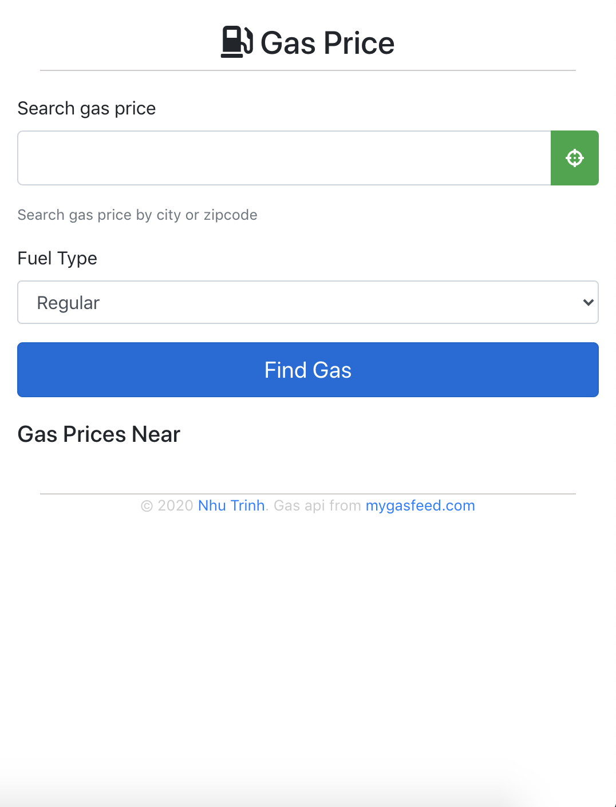
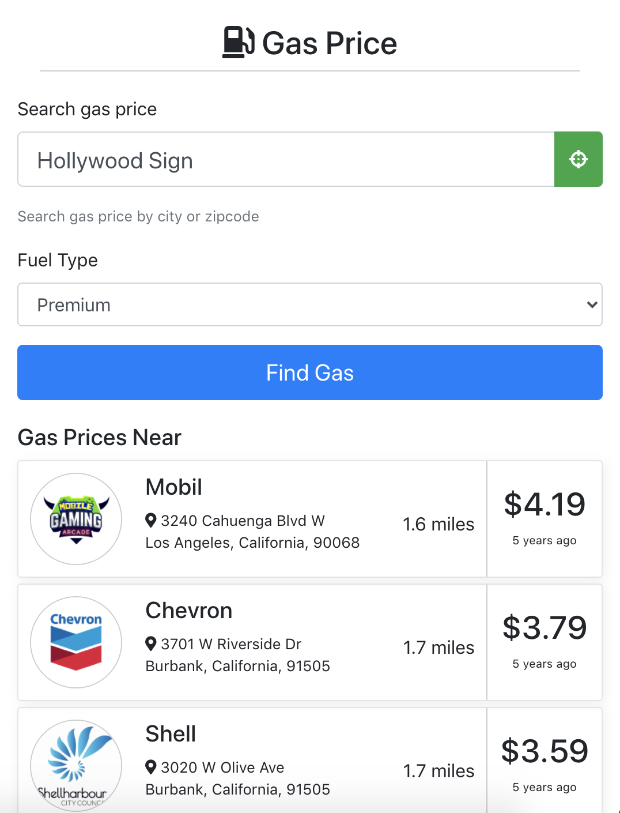

# Gas-Price
Small react app that display nearby gas station price.
Demo [https://gasprice.nhutrinh.com/](https://gasprice.nhutrinh.com/)

## Requirement
The Gas Price App displays a list of local gas stations and their prices. The application is to be developed in React 16 and meet the following requirements:
- Get the user’s current location from the browser.
- Query an online API to retrieve nearby gas stations and their prices.
- My Gas Feed provides a dated, but functional API
  - http://www.mygasfeed.com/keys/api
  - Usage Example:
http://devapi.mygasfeed.com/stations/radius/32.953695/-117.132800/8/reg/price/
rfej9napna.json

- Display the stations in a list sorted by nearest location (nearest at the top).
- Show the station with its name (brand), logo, address, prices, and distance to the station
- Draw inspiration from the following designs to style your list:
  - https://dribbble.com/shots/6351064-Travel-App
  - https://dribbble.com/shots/6549997-Offer-Card-Desktop
  - https://dribbble.com/shots/6414988-UI-Elements
- Logos can be retrieved from Clearbit
https://clearbit.com/logo

- The list should be responsive supporting mobile and desktop form factors
The app should be production ready in all respects.


## Screenshot





## Docker development environment

- API key config: create `.env` file at the root of project
```
GASFEED_API=http://devapi.mygasfeed.com
GASFEED_API_KEY=rfej9napna
GOOGLE_GEOCODING_API_KEY=<Your google api key>
```

- Build or rebuild docker image when dependencies changed
```
docker-compose build
```

- Run dev environment
```
docker-compose up
```
Visit the app at http://localhost:8000

- Build production
```
docker-compose -f docker-compose-prod.yml build
```

- Test backend
```
docker-compose run -e TESTING=true backend python -m unittest discover
```

- Test frontend
```
docker-compose run frontend npm run test
```